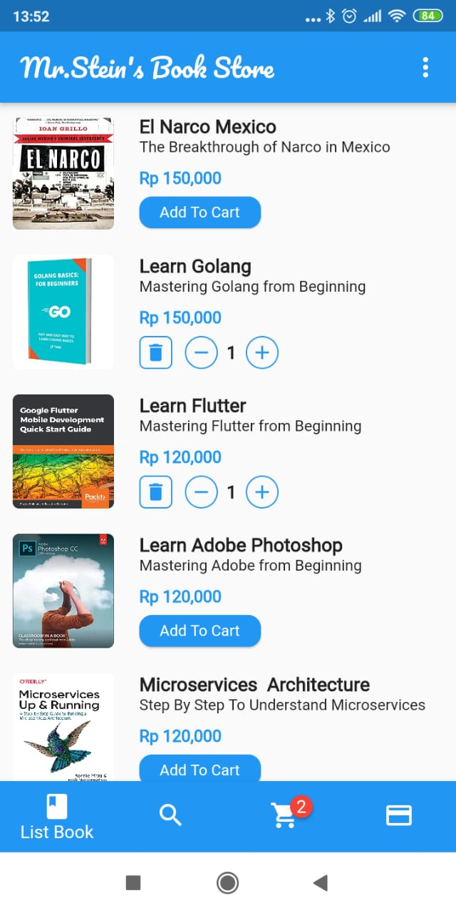
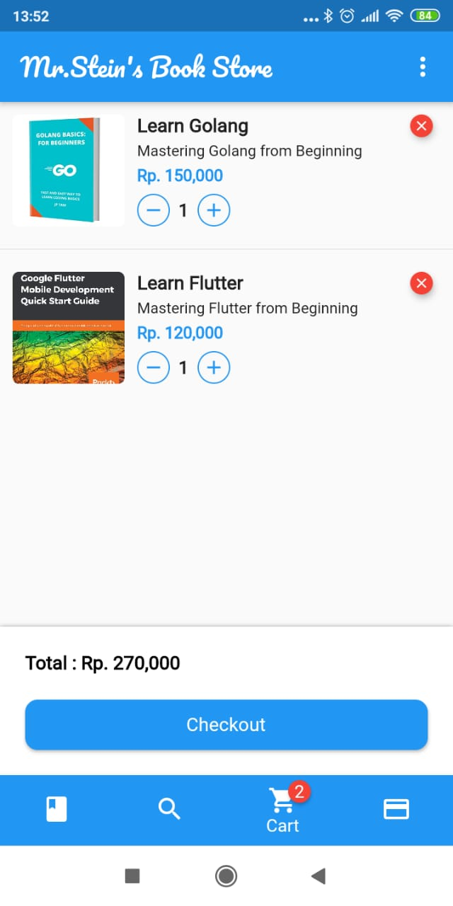

# Bookstore App

Aplikasi pembelian buku menggunakan  getX state management
untuk menghindari penggunaan setState dengan menggunakan GetXController
 dan Obx untuk mengupdate UI Widget

 untuk username password  :

 username : achmed@gmail.com
 password : jayaswara

 atau bisa juga register user di halaman register

## Backend API dan dokumentasi API

Untuk Backend API dan dokumentasi API bisa di ambil di https://github.com/mrstein21/BookStoreAPI
Silahkan ganti alamat API di folder lib/mixins/server.dart

## Screen Shoot Aplikasi
 
 

